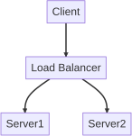

# Playwright Runner

Playwright Runner is a set of runners for [Playwright](https://playwright.dev/).

This module is intended to provide useful toolset for [Re:VIEW](https://reviewml.org/), but it can also be used for general purpose applications.

## Installation

Add this line to your application's Gemfile:

```ruby
gem 'playwrightrunner'
```

And then execute:

    $ bundle install

Or install it yourself as:

    $ gem install playwright-runner

Of course PlaywrightRunner needs Playwright npm library.

    $ npm install playwright    (locally)
    $ npm install -g playwright (globally)

## Usage

### Mermaid to PDF or SVG

Let's convert HTML files contain [Mermaid](https://mermaid.js.org/) to PDF/SVG.
You have to install two components also to crop and convert PDF before running:

- [pdfcrop](https://www.ctan.org/pkg/pdfcrop) in TeXLive.
- [pdftocairo](https://gitlab.freedesktop.org/poppler/poppler) in poppler (if you'd like to get SVG).

On Debian GNU/Linux or its derivatives, ues `apt-get install texlive-extra-utils poppler-utils`.

```ruby
PlaywrightRunner.mermaids_to_images(
  {
    playwright_path: './node_modules/.bin/playwright', // playwright binary path
    pdfcrop_path: 'pdfcrop', // pdfcrop path
    pdftocairo_path: 'pdftocairo' // pdftocairo path
  },
  src: '.', // source folder contains html files
  dest: '.', // destination folder to export pdf or svg
  type: 'pdf' // 'pdf' or 'svg'
)
```

It converts all HTML files in the folder specified by `src` into PDF or SVG files (specified by `type`) using that name and writes them in the folder specified by `dest`.

For Example, here is `p1.html` contains Mermaid code.

```html
<!DOCTYPE html>
<html>
<head>
  <meta charset="UTF-8">
  <script type="module">import mermaid from 'https://cdn.jsdelivr.net/npm/mermaid@10/dist/mermaid.esm.min.mjs'; mermaid.initialize({ startOnLoad: true });</script>
</head>
<body>
<div id="p1">
<pre class="mermaid">
graph TD
A[Client] --> B[Load Balancer]
B --> C[Server1]
B --> D[Server2]
</pre>
</div>
</body>
</html>
```

Now convert it to PDF. `p1.pdf` will be created.

```ruby
require 'playwrightrunner'

PlaywrightRunner.mermaids_to_images(
  {
    playwright_path: './node_modules/.bin/playwright' // modify for your env
  },
  src: '.',
  dest: '.',
  type: 'pdf'
)
```

Convert it to SVG. `p1.svg` will be created.

```ruby
require 'playwrightrunner'

PlaywrightRunner.mermaids_to_images(
  {
    playwright_path: './node_modules/.bin/playwright' // modify for your env
  },
  src: '.',
  dest: '.',
  type: 'svg'
)
```



## License

```
Copyright (c) 2023 Kenshi Muto

Permission is hereby granted, free of charge, to any person obtaining a copy
of this software and associated documentation files (the "Software"), to deal
in the Software without restriction, including without limitation the rights
to use, copy, modify, merge, publish, distribute, sublicense, and/or sell
copies of the Software, and to permit persons to whom the Software is
furnished to do so, subject to the following conditions:

The above copyright notice and this permission notice shall be included in all
copies or substantial portions of the Software.

THE SOFTWARE IS PROVIDED "AS IS", WITHOUT WARRANTY OF ANY KIND, EXPRESS OR
IMPLIED, INCLUDING BUT NOT LIMITED TO THE WARRANTIES OF MERCHANTABILITY,
FITNESS FOR A PARTICULAR PURPOSE AND NONINFRINGEMENT. IN NO EVENT SHALL THE
AUTHORS OR COPYRIGHT HOLDERS BE LIABLE FOR ANY CLAIM, DAMAGES OR OTHER
LIABILITY, WHETHER IN AN ACTION OF CONTRACT, TORT OR OTHERWISE, ARISING FROM,
OUT OF OR IN CONNECTION WITH THE SOFTWARE OR THE USE OR OTHER DEALINGS IN THE
SOFTWARE.
```
